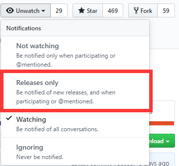

# Multicraft Shell Mirror
 Multicraft 脚本镜像

## 资源说明

该项目为 Kengwang Multicraft脚本的镜像站所要包含的文件

## 镜像添加说明

1. 首先,请Star本项目,点击右上角星星
2. 下载项目下所有文件,上传到您的服务器
3. Fork 此仓库
4. 在您Fork好的项目中的api.php中MirrorList数组添加您的镜像地址,请在您的地址后面加上muallver

```php
$mirrorList = array(
...
        array('name' => '您的资源名称', 'url' => '您的Mirror地址/muallver/'),
...
    )
```

5. 提交 Pull Request,并等待审核,审核人员会检查您的服务器文件是否完整并提出建议
6. 审核通过后,Pull Request将会合并,脚本API服务器可能会有点延迟
7. 也麻烦点个Watch Release, 以便同步最新版文件



## 镜像列表

Github 源: https://raw.githubusercontent.com/kengwang/Multicraft-Shell-Mirror/master/muallver/

码云(中国): https://gitee.com/kengwang/Multicraft-Shell-Mirror/raw/master/

Kengwang OSS源: https://multicraftshell.oss-cn-beijing.aliyuncs.com/muallver/